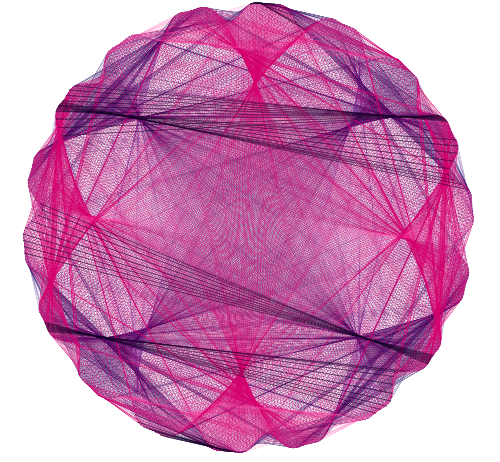

# Python_Pattern

This generative artwork is a **multi-layered modular chord rosette (Moiré Guilloché)** constructed by mapping dense mathematical chord webs across an undulating circular perimeter.

---

### **Key Structural & Visual Characteristics**

* **Dual-Layer Wireframe Mesh:**
* **Hot Magenta / Pink Mesh:** Forms dense, fine diamond-hatch cells across the central disk.
* **Deep Indigo / Violet Mesh:** Overlays the pink structure at a shifted angular orientation, producing complex **Moiré interference fringes** and translucent shading.


* **Modular Chord Multiplication ($t \to m \cdot t$):**
* Straight chord lines connect points on a modulated outer ring according to a modular multiplier rule ($m = 5$).
* The overlapping paths naturally generate internal focal nodes, self-assembling triangular fan blades, and curved envelope boundaries without explicitly plotting curves.


* **Dense Crease Spines:**
* Thicker, highly saturated bands traverse horizontally and diagonally across the disk.
* These spines emerge from dense clusters of near-parallel chords, giving the appearance of folded, pleated silk or origami paper.


* **Wavy Scalloped Rim:**
* The outer boundary follows a high-frequency harmonic waveform, producing a delicate ruffled border resembling a botanical rosette or chrysanthemum flower.

# Generative Moiré Rosette: Dual-Layer Wireframe Mesh

A mathematical generative art project that creates intricate, multi-layered floral rosettes using trigonometric chord multiplication, ruled-surface geometry, and optical Moiré interference patterns.

---

## Overview

This project explores the intersection of mathematics, data visualization, and generative aesthetics. By connecting nodes along a harmonically undulating perimeter across modular multiplication factors ($t \to m \cdot t$), the algorithm constructs an optical illusion of pleated, multi-dimensional fabric layers (chiffon/origami) using purely straight line segments.

### Key Visual & Mathematical Mechanics

* **Dual-Layer Ruled Mesh:** Two distinct chord networks (Deep Indigo & Hot Magenta) rendered at an angular phase shift, generating fine diamond cross-hatching across the disc.
* **Moiré Interference:** Overlapping ultra-thin chords ($lw \approx 0.25$) with subtle alpha transparency ($0.08 - 0.25$) produce self-assembling volumetric shading and focal nodes.
* **Harmonic Boundary Envelope:** The outer perimeter uses multi-frequency sine and cosine modulations to simulate the organic, ruffled rim of a botanical flower.
* **Emergent Crease Spines:** High-density chord clusters produce pronounced structural fold seams across primary diagonal and horizontal axes.

---

## Mathematical Formulation

1. **Perimeter Envelope ($P(\theta)$):**
   $$r(\theta) = 1.0 + A_1 \sin(f_1 \theta) + A_2 \cos(f_2 \theta)$$
   $$x(\theta) = r(\theta) \cos(\theta), \quad y(\theta) = r(\theta) \sin(\theta)$$

2. **Modular Chord Mapping:**
   Every sampled node index $i \in [0, N-1]$ on the perimeter is connected via a straight line chord to a target node index:
   $$\text{target}(i) = (i \cdot m) \pmod N$$
   where $m$ is the modular multiplier defining the geometric fold order.

3. **Phase-Shifted Layering:**
   The secondary mesh layer is mapped with a rotational offset $\Delta \theta$:
   $$\theta_2 = \theta + \Delta \theta$$

---

## Tech Stack

* **Language:** Python 3.9+
* **Libraries:**
  * `NumPy` — Vectorized trigonometric computation and angular discretization
  * `Matplotlib` — High-resolution vector rendering and raster export

---

## Quick Start

### 1. Installation

Clone the repository and install dependencies:

```bash
git clone [https://github.com/Ankitatan/generative-moire-rosette.git](https://github.com/Ankitatan/generative-moire-rosette.git)
cd generative-moire-rosette
pip install matplotlib numpy

---

### 2. Install Dependencies

pip install matplotlib numpy

---

###3. Run the Generator

python pattern_code.py

## Screenshot


